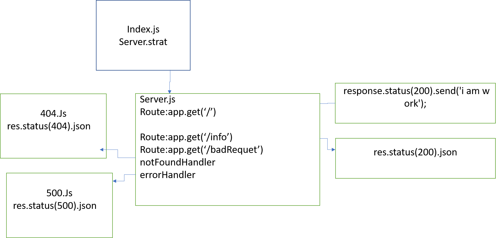

# server-deployment-practice

## Author: areenjaradat

### Links and Resources

- [ci/cd](https://github.com/areenjaradat/server-deployment-practice/actions) (GitHub Actions)

- [Repo link](https://github.com/areenjaradat/server-deployment-practice)

- [PR link](https://github.com/areenjaradat/server-deployment-practice/pulls)

- [Dev Branch Deployed heroku](https://areen-server-deploy-dev.herokuapp.com)

- [main Deployed heroku](https://areen-server-deploy-prod.herokuapp.com)

### Setup

#### `.env` requirements

#### `express` requirements

#### How to initialize/run your application (where applicable)

- `node server.js`

#### Tests

- How do you run tests?
   `npm test`

#### UML

